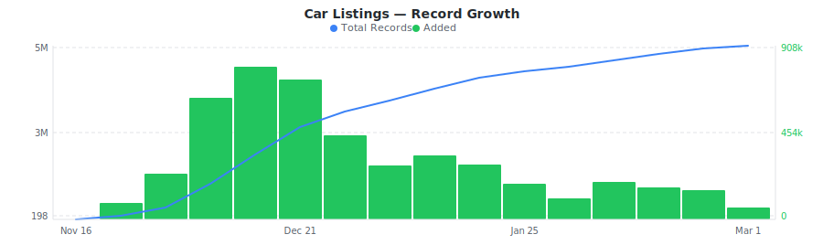

# Cars.com Vehicle Listings Dataset

&nbsp;&nbsp;[](https://rebrowser.net/products/datasets/carscom)

Daily sample of Cars.com vehicle listings with make, model, trim, mileage, body style, drivetrain, and dealer location across new and used inventory.


This repository contains a preview sample of the [Cars.com dataset](https://rebrowser.net/products/datasets/carscom) published by Rebrowser. If you're doing academic research, you may be eligible for free access to a much larger slice — see [Free Datasets for Research](https://rebrowser.net/free-datasets-for-research).


This dataset contains **1** entity, each in its own folder: Car Listings (`car-listings`). See below for a full field breakdown, sample counts, and data distributions for each.

*Found this useful? ⭐ Star this repo to help us keep publishing fresh data. Found an error? [Let us know](https://rebrowser.net/contact-us).*


---

### Car Listings
Sample of Cars.com vehicle listings with year, make, model, trim, mileage, body style, drivetrain, fuel type, and dealer location.


> **5,158,281** total records from 2025-11-16 to 2026-02-22, **up to 30,000** rows in this sample (0.58% of full dataset).
> Exported as one file per day, up to 1,000 rows each, last undefined days retained.



| Field | Type | Fill Rate | Description |
| --- | --- | --- | --- |
| `_primaryKey` | `string` | 100% | Unique identifier for this record |
| `_firstSeenAt` | `datetime` | 100% | First time this record was seen |
| `_lastSeenAt` | `datetime` | 100% | Last time this record was updated |
| `listingId` | `string` | 100% | Unique Cars.com listing UUID (e.g., 62a9e175-556a-49da-b18e-e2ac95ef83ba) |
| `vin` 🔒 | `string` | 100% | Vehicle Identification Number (17-character unique code) |
| `stockType` | `string` | 100% | Listing type (New, Used, Certified) |
| `year` | `float` | 100% | Vehicle model year |
| `make` | `string` | 100% | Vehicle manufacturer (e.g., Mazda, Audi, Toyota) |
| `model` | `string` | 100% | Vehicle model name (e.g., CX-5, Q5, Camry) |
| `trim` | `string` | 99% | Vehicle trim level (e.g., 2.5 S Preferred Package, Premium Plus 45 TFSI) |
| `price` 🔒 | `float` | 100% | Listed price in USD |
| `msrp` 🔒 | `float` | 48% | Manufacturer suggested retail price in USD |
| `mileage` | `float` | 99% | Odometer reading in miles |
| `bodyStyle` | `string` | 100% | Body style (Sedan, SUV, Coupe, Hatchback, Truck, etc.) |
| `exteriorColor` | `string` | 99% | Exterior color (e.g., Black, White, Silver) |
| `interiorColor` | `string` | 97% | Interior color (e.g., Black Leather, Beige) |
| `drivetrain` | `string` | 98% | Drivetrain type (e.g., All-wheel Drive, Front-wheel Drive, Four-wheel Drive, Rear-wheel Drive, FWD, AWD) |
| `transmission` | `string` | 2% | Transmission type (e.g., Automatic, Manual) |
| `engine` | `string` | 2% | Engine description (e.g., SKYACTIV-G 2.5L I-4) |
| `fuelType` | `string` | 98% | Fuel type (e.g., Gasoline, Hybrid, E85 Flex Fuel, Diesel) |
| `mpg` | `string` | 2% | EPA mileage rating range (e.g., 26-30) |
| `stockNumber` | `string` | 2% | Dealer stock number |
| `sellerType` | `string` | 100% | Seller type (e.g., dealership) |
| `sellerName` 🔒 | `string` | 99% | Seller/dealer name (e.g., Liberty Mazda, Audi Richmond) |
| `sellerCity` | `string` | 99% | Seller city location |
| `sellerState` | `string` | 99% | Seller state abbreviation (e.g., CT, VA) |
| `images` 🔒 | `array` | 2% | Array of all listing photo URLs |
| `imagesCount` | `float` | 2% | Number of listing images |
| `options` | `array` | 2% | Array of vehicle options (e.g., Adaptive Cruise Control, Heated Seats, Bluetooth) |
| `optionsCount` | `float` | 2% | Number of vehicle options |
| `description` | `string` | 2% | Seller description/notes about the vehicle |
| `listingUrl` 🔒 | `string` | 100% | Full URL to the Cars.com vehicle listing page |


> 🔒 **Premium fields** are included in the data files but their values are replaced with `[PREMIUM]`. To access real values, [use our website](https://rebrowser.net/products/datasets/carscom).


#### Field Distributions


<details>
<summary><strong>Stock Type (New/Used/Certified)</strong> (<code>stockType</code>)</summary>


| Value | Count | Share |
| --- | --- | --- |
| Used | 2,829,114 | `███████████░░░░░░░░░` 54.8% |
| New | 2,329,167 | `█████████░░░░░░░░░░░` 45.2% |

</details>


<details>
<summary><strong>Body Style Distribution</strong> (<code>bodyStyle</code>)</summary>


| Value | Count | Share |
| --- | --- | --- |
| SUV | 2,872,243 | `███████████░░░░░░░░░` 55.8% |
| Truck | 993,585 | `████░░░░░░░░░░░░░░░░` 19.3% |
| Sedan | 797,859 | `███░░░░░░░░░░░░░░░░░` 15.5% |
| Hatchback | 139,513 | `█░░░░░░░░░░░░░░░░░░░` 2.7% |
| Coupe | 111,281 | `░░░░░░░░░░░░░░░░░░░░` 2.2% |
| Passenger Van | 77,808 | `░░░░░░░░░░░░░░░░░░░░` 1.5% |
| Cargo Van | 60,858 | `░░░░░░░░░░░░░░░░░░░░` 1.2% |
| Convertible | 56,857 | `░░░░░░░░░░░░░░░░░░░░` 1.1% |
| Minivan | 19,897 | `░░░░░░░░░░░░░░░░░░░░` 0.4% |
| Wagon | 17,334 | `░░░░░░░░░░░░░░░░░░░░` 0.3% |

</details>


<details>
<summary><strong>Top Vehicle Makes</strong> (<code>make</code>)</summary>


| Value | Count | Share |
| --- | --- | --- |
| Ford | 673,334 | `████░░░░░░░░░░░░░░░░` 18.9% |
| Chevrolet | 526,742 | `███░░░░░░░░░░░░░░░░░` 14.8% |
| Toyota | 485,948 | `███░░░░░░░░░░░░░░░░░` 13.6% |
| Honda | 357,016 | `██░░░░░░░░░░░░░░░░░░` 10.0% |
| Nissan | 290,751 | `██░░░░░░░░░░░░░░░░░░` 8.2% |
| Jeep | 280,102 | `██░░░░░░░░░░░░░░░░░░` 7.9% |
| Hyundai | 278,923 | `██░░░░░░░░░░░░░░░░░░` 7.8% |
| Kia | 255,095 | `█░░░░░░░░░░░░░░░░░░░` 7.2% |
| GMC | 223,053 | `█░░░░░░░░░░░░░░░░░░░` 6.3% |
| BMW | 193,060 | `█░░░░░░░░░░░░░░░░░░░` 5.4% |

</details>


<details>
<summary><strong>Fuel Type Distribution</strong> (<code>fuelType</code>)</summary>


| Value | Count | Share |
| --- | --- | --- |
| Gasoline | 4,329,131 | `█████████████████░░░` 85.4% |
| Hybrid | 303,248 | `█░░░░░░░░░░░░░░░░░░░` 6.0% |
| Diesel | 191,244 | `█░░░░░░░░░░░░░░░░░░░` 3.8% |
| Electric | 161,845 | `█░░░░░░░░░░░░░░░░░░░` 3.2% |
| E85 Flex Fuel | 55,675 | `░░░░░░░░░░░░░░░░░░░░` 1.1% |
| Gas | 15,145 | `░░░░░░░░░░░░░░░░░░░░` 0.3% |
| Plug-In Hybrid | 4,491 | `░░░░░░░░░░░░░░░░░░░░` 0.1% |
| Regular unleaded | 3,166 | `░░░░░░░░░░░░░░░░░░░░` 0.1% |
| Flexible Fuel | 3,065 | `░░░░░░░░░░░░░░░░░░░░` 0.1% |
| Regular Unleaded | 2,366 | `░░░░░░░░░░░░░░░░░░░░` 0.0% |

</details>


<details>
<summary><strong>Listings by State</strong> (<code>sellerState</code>)</summary>


| Value | Count | Share |
| --- | --- | --- |
| FL | 522,750 | `████░░░░░░░░░░░░░░░░` 18.4% |
| TX | 521,159 | `████░░░░░░░░░░░░░░░░` 18.3% |
| CA | 473,688 | `███░░░░░░░░░░░░░░░░░` 16.6% |
| OH | 244,336 | `██░░░░░░░░░░░░░░░░░░` 8.6% |
| IL | 240,454 | `██░░░░░░░░░░░░░░░░░░` 8.4% |
| NY | 189,460 | `█░░░░░░░░░░░░░░░░░░░` 6.7% |
| GA | 177,627 | `█░░░░░░░░░░░░░░░░░░░` 6.2% |
| NJ | 162,054 | `█░░░░░░░░░░░░░░░░░░░` 5.7% |
| NC | 157,676 | `█░░░░░░░░░░░░░░░░░░░` 5.5% |
| PA | 157,464 | `█░░░░░░░░░░░░░░░░░░░` 5.5% |

</details>


---

## Pre-built Views on Rebrowser

Rebrowser web viewer lets you filter, sort, and export any slice of this dataset interactively. These pre-built views are ready to open:


### Car Listings


[Vehicle Listings with Pricing](https://rebrowser.net/products/datasets/carscom/car-listings/views/listings-with-pricing) — 4,757,458 records

↳ `[{"field":"price","op":"gt","value":0},{"sort":"price ASC"}]`

[New Vehicle Listings](https://rebrowser.net/products/datasets/carscom/car-listings/views/new-vehicle-listings) — 2,206,652 records

↳ `[{"field":"stockType","op":"is","value":"New"},{"sort":"price ASC"}]`

[Used Vehicle Listings](https://rebrowser.net/products/datasets/carscom/car-listings/views/used-vehicle-listings) — 2,552,202 records

↳ `[{"field":"stockType","op":"is","value":"Used"},{"sort":"price ASC"}]`

[Listings with Multiple Photos](https://rebrowser.net/products/datasets/carscom/car-listings/views/listings-with-photos) — 91,181 records

↳ `[{"field":"imagesCount","op":"gt","value":5},{"sort":"imagesCount DESC"}]`

[SUV Listings](https://rebrowser.net/products/datasets/carscom/car-listings/views/suv-listings) — 2,652,194 records

↳ `[{"field":"bodyStyle","op":"is","value":"SUV"},{"sort":"price ASC"}]`


*[See all 34 views →](https://rebrowser.net/products/datasets/carscom/car-listings)*


---

## Code Examples

```python
import pandas as pd
from pathlib import Path

# ── Car Listings ─────────────────────────────────────────────────────────────
files = sorted(Path('rebrowser/carscom-dataset/car-listings/data').glob('*.parquet'))[-7:]
listings = pd.concat([pd.read_parquet(f) for f in files])

# Top 15 makes by listing count
print(listings['make'].value_counts().head(15).to_string())

# Body style breakdown for used vehicles
used = listings[listings['stockType'] == 'Used']
print(used['bodyStyle'].value_counts().to_string())

# Average mileage by body style for used cars
print(used.groupby('bodyStyle')['mileage'].mean().sort_values().to_string())

# States with the most listings
print(listings['sellerState'].value_counts().head(10).to_string())

# Fuel type distribution across all listings
print(listings['fuelType'].value_counts().to_string())

# Listings per model year (most recent years)
print(listings['year'].value_counts().sort_index(ascending=False).head(10).to_string())
```

---

## Use Cases


### Inventory Composition Analysis

Group listings by body style, drivetrain, and fuel type to understand how dealer inventory is distributed across vehicle segments and regions.


### Regional Market Comparison

Filter by seller state to compare which makes and models dominate specific geographic markets. Identify regional preferences like truck-heavy states vs sedan markets.


### Vehicle Specification Trends

Analyze how trim levels, drivetrain types, and fuel options shift across model years. Track the growth of hybrid and electric listings relative to gasoline.


### Listing Quality Benchmarking

Compare image counts and option detail completeness across listings to benchmark what constitutes a high-quality vehicle listing on Cars.com.


---

## Full Dataset on Rebrowser


This repo is a 1,000-row preview sample. The full dataset is at [rebrowser.net/products/datasets/carscom](https://rebrowser.net/products/datasets/carscom)

Doing academic research? You may qualify for free access to a larger slice. See [Free Datasets for Research](https://rebrowser.net/free-datasets-for-research).

On Rebrowser you can:
- **Filter before you buy** — use the web UI to apply filters on any field and sort by any column. Preview results before purchasing. You only pay for records that match your criteria.
- **Export in your format** — CSV, JSON, JSONL, or Parquet depending on your plan.
- **Access via API** — integrate dataset queries into your pipelines and workflows.
- **Choose your freshness** — plans range from a 14-day lag to real-time data with no delay.
- **Select only the fields you need** — keep exports lean. Premium fields with richer data are available on higher plans.

[Pricing](https://rebrowser.net/pricing) starts at **$2 per 1,000 rows** with volume discounts.

---

## License & Terms

**Free for research and non-commercial use** with attribution. See [license terms](https://rebrowser.net/free-datasets-for-research#license) and [how to cite](https://rebrowser.net/free-datasets-for-research#citation).

```bibtex
@misc{rebrowser_carscom,
  author       = {Rebrowser},
  title        = {Cars.com Vehicle Listings Dataset},
  year         = {2026},
  howpublished = {\url{https://rebrowser.net/products/datasets/carscom}},
  note         = {Accessed: YYYY-MM-DD}
}
```

Commercial use requires a paid license — see [pricing](https://rebrowser.net/pricing). Use of this data is governed by the [Rebrowser Terms of Use](https://rebrowser.net/terms-of-use), which may be updated at any time independently of this repository.

---

## Disclaimer

Rebrowser is an independent data provider and is not affiliated with, endorsed by, or sponsored by Cars.com. Any trademarks are the property of their respective owners. This dataset is compiled from publicly available information; we do not request or collect Cars.com user credentials. By using this dataset, you agree to comply with Cars.com's Terms of Service and all applicable laws and regulations. Images, logos, descriptions, and other materials included in this dataset remain the intellectual property of their respective owners and are provided solely for informational purposes. Rebrowser makes no warranties regarding the accuracy, completeness, or legality of the data and assumes no liability for how the data is used. You are solely responsible for ensuring that your use of this dataset does not infringe on the rights of any third party.


You can also find this data on [Kaggle](https://www.kaggle.com/datasets/rebrowser/carscom-dataset), [HuggingFace](https://huggingface.co/datasets/rebrowser/carscom-dataset), [Zenodo](https://doi.org/10.5281/zenodo.18716326).


